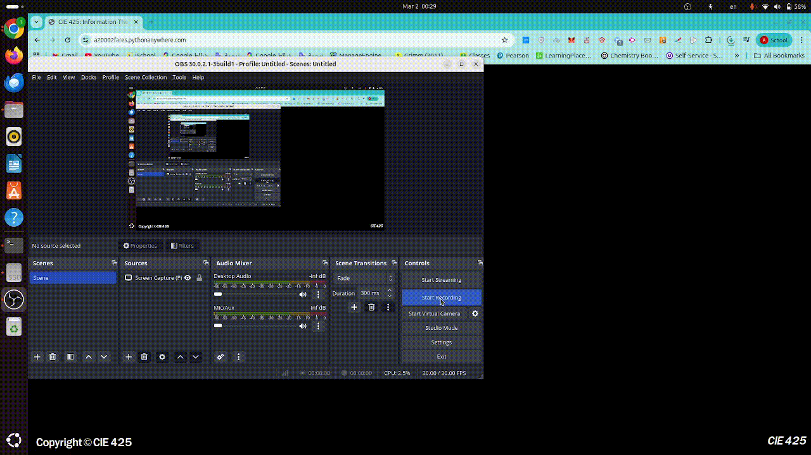

# 🚀 Shannon's Sandbox: Information Theory Course Project

Welcome to **Shannon's Sandbox**  This is a dynamic, high-precision web-based toolkit built for diving deep into the fascinating world of Information Theory, Source Coding, and Digital Communications.
## Demo


## ✨ Features

🔍 **Information Theory Analysis**
- Instantly analyze text files to compute their Probability Mass Functions (PMF).
- Calculate core metrics: **Entropy H(X)**, **Relative Entropy**, **Joint Entropy H(X,Y)**, and **Conditional Entropy H(Y|X)**.
- Simulate transmission over a Binary Symmetric Channel (BSC) and evaluate bit/character error rates.
- Computationally verify Shannon's Chain Rule in real-time!

🗜️ **Source Coding & Compression**
- Compare **Fixed-Length**, **Huffman**, and **Shannon-Fano** coding on uniform and highly skewed (arbitrary) distributions.
- Upload text files and squish them down to the theoretical limit, visualizing compression ratios while recovering data completely losslessly.

🌍 **Universal Source Coding**
- Step into the realm of **Adaptive Arithmetic Coding**. Our arbitrary-precision handlers keep calculations razor-sharp, maintaining state as dynamic probabilities turn into pure compressed magic!

📡 **BPSK Simulation**
- A robust, dedicated simulation pipeline for Binary Phase Shift Keying.

## 🛠️ Tech Stack

- **Backend:** Python + Flask (turbocharged with `getcontext().prec = 50` for extreme decimal precision!).
- **Frontend:** Slick, interactive HTML/JS UI complete with 3D carousels.
- **Algorithms under the hood:** Custom prefix-code trees, `heapq`, probabilities matrices, and the sheer will of Claude Shannon.

## 🚀 Getting Started

1. Check out the project!
2. Ensure you have the required dependencies installed:
   ```bash
   pip install -r requirements.txt
   ```
3. Boot up the lab:
   ```bash
   python app.py
   # or
   flask run
   ```
4. Open your browser to the local server, navigate to the dashboard, and start experimenting with bits and bytes!

---

*Ready to hit the Shannon limit? Let's compress reality!* 📉✨
